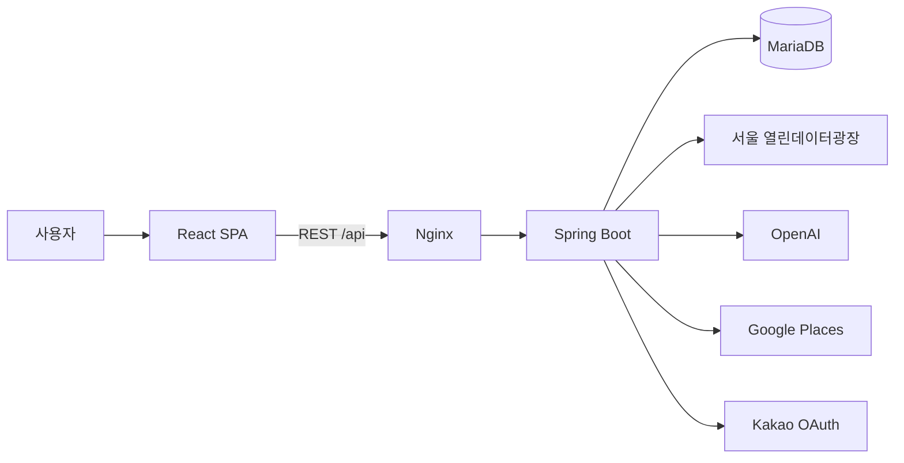

<div align="center">


# CultureMate

### 행사를 찾고, 하루를 완성하다.

서울의 문화행사를 발견하고 주변 장소를 연결해<br />
나만의 문화 코스로 저장하고 공유하는 문화생활 플래너

[](https://github.com/CultureMate/CultureMate-platform/actions/workflows/ci.yml)


[서비스 소개](#서비스-소개) · [주요 기능](#주요-기능) · [아키텍처](#아키텍처) · [실행 방법](#로컬-실행) · [팀](#팀-culturemate)

</div>

---

## 서비스 소개

문화행사를 고른 뒤에도 사용자는 지도 앱, 검색, 메모장과 메신저를 오가며 주변 장소와 방문 순서를 다시 정리해야 합니다. CultureMate는 **행사 탐색 → 장소 추천 → 코스 구성 → 저장과 공유**의 흐름을 하나의 서비스로 연결합니다.

```text
문화행사 발견  →  AI 소개 확인  →  주변·사이 장소 추천  →  코스 저장  →  링크 공유
```

## 주요 기능

| | 기능 | 설명 |
|---|---|---|
| 🎭 | 문화행사 탐색 | 분야·자치구·날짜·키워드로 서울 문화행사를 탐색합니다. |
| ✨ | AI 행사 소개 | 행사 원문을 바탕으로 2~3문장의 소개를 생성하고 저장본을 재사용합니다. |
| ☕ | 주변 장소 추천 | 행사 주변의 카페와 음식점을 찾아 코스에 추가합니다. |
| 🧭 | 사이 장소 추천 | 두 행사 사이의 거리와 우회 정도를 반영해 중간 장소를 추천합니다. |
| 🗺️ | 코스 만들기 | 행사와 장소를 원하는 순서로 배치하고 저장·수정합니다. |
| ⭐ | 관심 목록 | 관심 행사와 관심 코스를 한곳에서 관리합니다. |
| 🔗 | 코스 공유 | 로그인하지 않은 사용자도 읽기 전용 링크로 코스를 확인합니다. |
| 🔐 | 카카오 로그인 | OAuth 로그인과 서버 세션으로 사용자를 인증합니다. |

## 저장소 구성

| 저장소 | 역할 | 기준 버전 |
|---|---|---|
| **[CultureMate-platform](https://github.com/CultureMate/CultureMate-platform)** | 통합 실행·아키텍처·프로젝트 문서 | `main` |
| [CultureMate-frontend](https://github.com/CultureMate/CultureMate-frontend) | React SPA와 사용자 화면 | `87595fa` |
| [CultureMate-backend](https://github.com/CultureMate/CultureMate-backend) | REST API·외부 API 연동·데이터 저장 | `6b77b11` |

이 저장소는 검증된 프론트엔드와 백엔드 버전을 Git submodule로 고정합니다. 한 번의 clone으로 전체 구성을 받고 Docker Compose로 함께 실행할 수 있습니다.

## 아키텍처



| 영역 | 기술 |
|---|---|
| Frontend | React 19, React Router, Axios, Tailwind CSS |
| Backend | Java 17, Spring Boot, Spring Web, Data JPA, Validation, Flyway |
| Database | H2(Local), MariaDB 10.11(Docker) |
| Infrastructure | Docker Compose, Nginx, GitHub Actions |
| External API | 서울 열린데이터광장, OpenAI, Google Places, Kakao OAuth |

자세한 내용은 [시스템 아키텍처 문서](docs/architecture.md)에서 확인할 수 있습니다.

## 핵심 설계

- **원본 데이터 캐시** — 서울시 행사 원본은 DB에 전체 복제하지 않고 서버에서 30분 캐시합니다.
- **행사 스냅샷** — 코스 저장 시 핵심 행사 정보를 남겨 원본 변경 이후에도 코스를 보존합니다.
- **최신 장소 정보** — Google 장소는 `placeId`만 저장하고 코스를 열 때 최신 상세 정보를 조회합니다.
- **동시 수정 보호** — 코스 버전 검사로 오래된 화면이 최신 변경을 덮어쓰지 못하게 합니다.
- **외부 API 보호** — 검색·사진·상세 호출량을 구분하며 API 키는 백엔드 환경변수에서만 사용합니다.
- **AI 결과 재사용** — 행사당 생성 결과 한 건을 저장해 같은 소개문 요청에서 GPT를 다시 호출하지 않습니다.

## 로컬 실행

### 1. 저장소와 하위 프로젝트 받기

```bash
git clone --recurse-submodules https://github.com/CultureMate/CultureMate-platform.git
cd CultureMate-platform
```

이미 저장소를 받은 경우에는 다음 명령으로 하위 프로젝트를 내려받습니다.

```bash
git submodule update --init --recursive
```

### 2. 환경변수 준비

```bash
cp .env.example .env
```

Windows PowerShell:

```powershell
Copy-Item .env.example .env
```

생성된 `.env`에 DB 비밀번호와 필요한 외부 API 키를 입력합니다. 실제 키가 들어간 `.env`는 `.gitignore`에 포함되어 Git에 올라가지 않습니다.

### 3. 전체 서비스 실행

```bash
docker compose up --build
```

브라우저에서 `http://localhost`로 접속합니다.

```bash
docker compose down
```

> `docker compose down -v`는 MariaDB 볼륨까지 삭제합니다. 저장 데이터를 초기화할 때만 사용하세요.

## 팀 CultureMate

| 이름 | 역할 | 주요 담당 |
|---|---|---|
| 강민구 | Backend · Team Lead | AI 소개문, Google Places, 코스 API, 사이 장소 추천 |
| 최환우 | Backend | 카카오 로그인, 서울시 API, 조회수, ERD, Docker, 통합 개선 |
| 김우석 | Backend | 관심 행사, 마이페이지, 댓글, 서울시 원본 정제, 테스트 문서 |
| 문한일 | Frontend | 행사 탐색·상세, 지도, 댓글, 코스·공유 화면, UI 개선 |
| 손수연 | Frontend | 로그인, 프로필, 관심 목록, 캘린더, 마이페이지 |

## 프로젝트 문서

- [시스템 아키텍처](docs/architecture.md)
- [기여 방법](CONTRIBUTING.md)
- [환경변수 예시](.env.example)

---

<div align="center">

LG CNS AM INSPIRE CAMP 6기 미니 프로젝트

</div>
