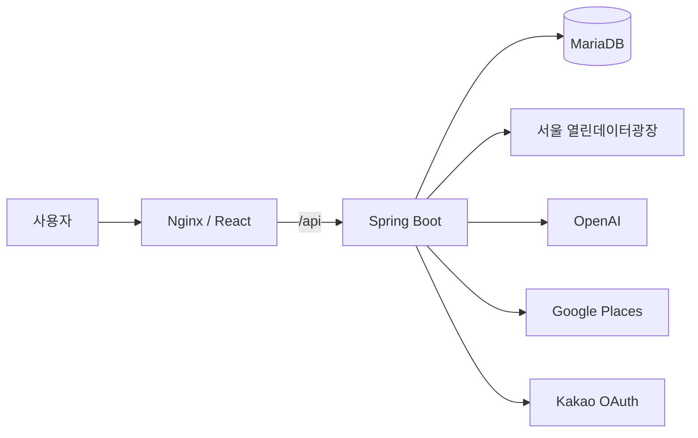

<p align="center">
  
</p>

<h1 align="center">CultureMate</h1>

<p align="center"><strong>행사를 찾고, 하루를 완성하다.</strong></p>

<p align="center">
서울의 문화행사를 발견하고, 행사 사이의 카페와 음식점을 연결해<br />
하나의 코스로 저장하고 공유하는 문화생활 플래너입니다.
</p>

<p align="center">
  <a href="https://github.com/CultureMate/CultureMate-frontend">Frontend</a> ·
  <a href="https://github.com/CultureMate/CultureMate-backend">Backend</a> ·
  <a href="docs/architecture.md">Architecture</a>
</p>

---

## CultureMate가 해결하는 문제

문화행사를 고른 뒤에도 사용자는 지도 앱, 검색, 메모장과 메신저를 오가며 주변 장소와 방문 순서를 다시 정리해야 합니다. CultureMate는 행사 탐색부터 코스 저장과 공유까지의 흐름을 한 서비스로 연결합니다.

## 주요 기능

- 서울 열린데이터광장 문화행사 목록·상세 조회
- 분야·자치구·날짜·키워드 기반 행사 탐색
- OpenAI 기반 행사 소개문 생성 및 저장본 재사용
- 행사 주변 카페·음식점 추천
- 두 행사 사이의 거리와 우회 정도를 반영한 장소 추천
- 순서가 있는 문화 코스 저장·수정·즐겨찾기
- 읽기 전용 코스 공유 링크
- 카카오 OAuth 로그인과 서버 세션 인증

## 저장소 구성

| 저장소 | 역할 |
|---|---|
| [CultureMate-platform](https://github.com/CultureMate/CultureMate-platform) | 통합 실행, 아키텍처, 프로젝트 문서 |
| [CultureMate-frontend](https://github.com/CultureMate/CultureMate-frontend) | React SPA, 사용자 화면 |
| [CultureMate-backend](https://github.com/CultureMate/CultureMate-backend) | Spring Boot REST API, 외부 API 연동, 데이터 저장 |

이 저장소는 프론트엔드와 백엔드를 Git submodule로 고정해, 검증된 두 버전을 한 번에 내려받고 실행할 수 있게 합니다.

## 시스템 구성



- Frontend: React 19, React Router, Axios, Tailwind CSS
- Backend: Java 17, Spring Boot, Spring Web, Data JPA, Validation, Flyway
- Database: H2(Local), MariaDB(Docker)
- Infrastructure: Docker Compose, Nginx

## 로컬 실행

### 1. 저장소 받기

```bash
git clone --recurse-submodules https://github.com/CultureMate/CultureMate-platform.git
cd CultureMate-platform
```

이미 저장소를 받은 뒤라면 다음 명령으로 하위 저장소를 내려받습니다.

```bash
git submodule update --init --recursive
```

### 2. 환경변수 준비

```bash
cp .env.example .env
```

Windows PowerShell에서는 다음 명령을 사용합니다.

```powershell
Copy-Item .env.example .env
```

`.env`에 DB 비밀번호와 필요한 외부 API 키를 입력합니다. 실제 키가 들어간 `.env`는 Git에 커밋하지 않습니다.

### 3. 전체 서비스 실행

```bash
docker compose up --build
```

실행 후 `http://localhost`에서 서비스를 확인합니다.

```bash
docker compose down
```

> `docker compose down -v`는 MariaDB 볼륨을 삭제하므로 저장 데이터를 초기화하려는 경우에만 사용하세요.

## 핵심 설계

- 서울시 행사 원본은 DB에 전체 복제하지 않고 서버에서 30분 캐시합니다.
- 코스 저장 시 행사 정보는 스냅샷으로 남겨 원본 변경에도 코스를 보존합니다.
- Google 장소는 `placeId`만 저장하고 다시 열 때 최신 정보를 조회합니다.
- 코스 수정에는 버전 검사를 적용해 오래된 화면이 최신 변경을 덮어쓰지 못하게 합니다.
- 외부 API 검색·사진·상세 호출량을 구분해 관리합니다.
- API 키는 백엔드 환경변수에서만 사용합니다.

## 팀

| 이름 | 역할 | 주요 담당 |
|---|---|---|
| 강민구 | Backend · Team Lead | AI 소개문, Google Places, 코스 API, 사이 장소 추천 |
| 최환우 | Backend | 카카오 로그인, 서울시 API, 조회수, ERD, Docker, 통합 개선 |
| 김우석 | Backend | 관심 행사, 마이페이지, 댓글, 서울시 원본 정제, 테스트 문서 |
| 문한일 | Frontend | 행사 탐색·상세, 지도, 댓글, 코스·공유 화면, UI 개선 |
| 손수연 | Frontend | 로그인, 프로필, 관심 목록, 캘린더, 마이페이지 |

## 프로젝트 문서

- [시스템 아키텍처](docs/architecture.md)
- [기여 방법](CONTRIBUTING.md)

## 상태

CultureMate는 LG CNS AM INSPIRE CAMP 6기 미니 프로젝트로 제작되었습니다. 현재 저장소는 시연과 포트폴리오를 위한 통합 실행 기준을 제공합니다.
