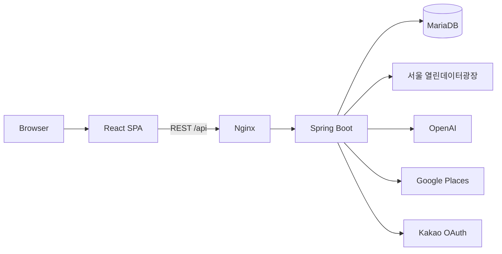

# CultureMate 시스템 아키텍처

## 전체 흐름

## 저장 원칙

- 서울시 행사 원본은 30분 동안 메모리에 캐시합니다.
- 회원, 세션, 찜, 댓글, 조회수, AI 소개문과 코스는 MariaDB에 저장합니다.
- 행사 스탑은 저장 시점의 핵심 정보를 스냅샷으로 남깁니다.
- Google 장소는 `placeId`만 저장하고 상세 정보는 다시 조회합니다.

## 인증

카카오 OAuth 콜백에서 회원을 식별한 뒤 7일짜리 서버 세션을 발급합니다. 브라우저에는 HttpOnly 세션 쿠키만 전달하며 카카오 액세스 토큰을 저장하지 않습니다.

## 통합 실행

Nginx가 React 정적 파일을 제공하고 `/api` 요청을 Spring Boot로 전달합니다. Docker Compose는 MariaDB의 준비 상태를 확인한 뒤 백엔드와 프론트엔드를 순서대로 시작합니다.
